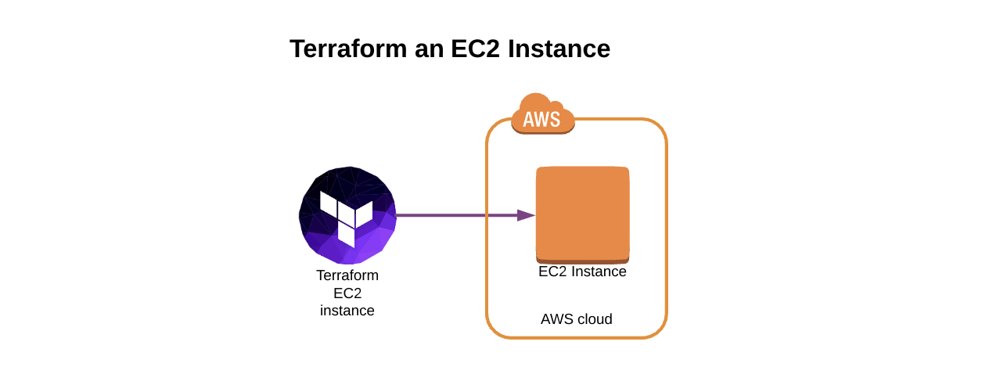

# Terraform ec2 instance
Simple example of how to provision an EC2 instance with Terraform. This repo is used to show how to use AWS CodeBuild as a `Terraform` service [here](https://github.com/randomtask2000/terraform_codebuild_ec2_instance).

## Setup
Create a settings file `terraform.auto.tfvars` that will configure access to your `AWS VPC` and let you `ssh` into your `EC2` instance after you're done:
```
echo <<< EOL
aws_access_key = "XXXXXXXXXXXXXXXXXXXX"
aws_secret_key = "xxxxxxxxxxxxxxxxxxxxxxxxxxxxxxxxxxxxxxxx"
aws_region = "us-east-1"
public_key = "ssh-rsa AAAAB3NzaC1yc2EAAAABIwAAAQ...rf+M7Q== my@laptop.local"
vpc_id = "vpc-00000000x00x0xxx0"
EOL >> terraform.auto.tfvars;
```
## Run Terraform
After you're done creating the above file and adding your `aws access key`, `secret` and your `ssh public key`, run the following:
```
terraform init
terraform plan
echo yes | terraform apply
```
To remove the instance you run:
```
echo yes | terraform destroy
```
## Done
You're done and have fun!